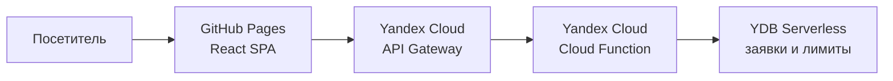

# Инфраструктура проекта

```mermaid
flowchart LR
    visitor[Посетитель] --> pages[GitHub Pages<br/>React SPA]
    pages --> gateway[Yandex Cloud<br/>API Gateway]
    gateway --> function[Yandex Cloud<br/>Cloud Function]
    function --> ydb[YDB Serverless<br/>заявки и лимиты]
```

Облачную часть API и базу данных создаёт Terraform. Сайт публикуется отдельно через GitHub Pages.
